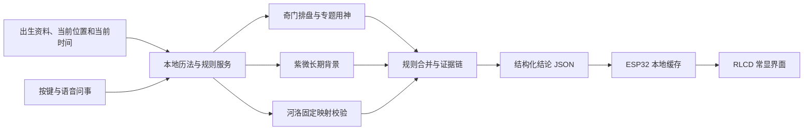

# SeeWay Rhythm

> 一个以奇门遁甲为主、紫微斗数为背景的个人时空节律终端。

SeeWay Rhythm 当前已经完成多 Agent 可信底座、时间核心、奇门基础排盘、独立复核、首批有出处的八门规则，以及 ESP32-S3 RLCD 实机链路。第一版面向单用户、本地优先的个人研究场景：设备常显当前两小时时段的重点提示，并允许用户通过按键查看下一时辰和完整九宫盘。项目不以随机文案代替排盘；每个领域 Agent 可以参与解释、权衡和结论判断，但不能修改盘面事实，所有结论都必须来自可复现、可追溯的计算与规则证据。

## 当前目标

- 每个时辰自动更新当前节律、顺势事项、留意事项和方向提示。
- 以奇门遁甲承担当前时段和专题问事判断。
- 以紫微斗数提供流年、阶段和个人长期背景。
- 以河图洛书校验九宫、五行、八卦、数字与方位等固定映射。
- 日常界面只显示结论，后台保留完整盘面、用神、规则和证据链。
- 出生资料与使用记录默认保存在本地。

## 两种使用状态

### 1. 常显模式

设备默认显示当前两小时时段：

- 当前时段与剩余时间
- 顺势事项
- 留意事项
- 有利方向与回避方向
- 一句可执行建议
- 下一时段预告
- 紫微长期背景摘要

同一个时段可以在不同事项上同时存在有利和不利倾向。系统不会把整个时辰粗略标记为“全吉”或“全凶”；证据不足时应明确显示“暂无显著倾向”。

### 2. 问事模式

首版专题类别包括：

1. 感情与关系
2. 事业与决策
3. 学习与专注
4. 金钱与交易
5. 出行与行程
6. 合作与沟通
7. 家庭与居所
8. 选时间与方向

基本流程：

```text
按住 KEY 进入问事
-> 说出事项和计划时间
-> 显示识别文字与事项分类
-> 用户确认或重录
-> 结构化提取人物、事件、时间、地点和目标
-> 必要时只追问一个关键问题
-> 规则引擎计算
-> 输出结论、利弊、方向、时机、建议和依据
```

语音模型负责识别和结构化问题。领域 Agent 内的推理模型可以在规则允许的范围内参与判断，但不得修改排盘事实、引用不存在的规则或把证据不足表达成确定吉凶。

## 目标硬件

第一版目标设备为 [Waveshare ESP32-S3-RLCD-4.2](https://www.waveshare.net/shop/ESP32-S3-RLCD-4.2-EN.htm)：

- ESP32-S3 双核处理器，最高 240 MHz
- 16 MB Flash、8 MB PSRAM
- 4.2 英寸 300 x 400 黑白全反射 RLCD
- 2.4 GHz Wi-Fi、Bluetooth LE 5
- 双麦克风、音频编解码、外接扬声器
- PCF85063 RTC、Micro SD 卡槽
- KEY、BOOT 两个可编程按键和一个 PWR 电源按键
- 可选 18650 电池供电

这块屏幕适合低功耗常显和快速局部更新，但有两个明确限制：

- 产品资料未列出触摸功能，首版交互必须以按键和语音为主。
- RLCD 依赖环境光且没有背光，暗处需要外部照明。

## 首版架构

ESP32 首版定位为常显和语音终端，完整规则计算放在本地服务中，便于迭代和核验。



### 设备端职责

- RTC 校时与时辰切换
- RLCD 页面渲染
- 按键交互
- 语音采集和音频播放
- Wi-Fi 通信
- 缓存已验证的当前与下一时辰结果
- 断网时只显示仍与目标时辰匹配的缓存，不把过期结果当成当下结论

### 本地服务职责

- 公历、农历、干支、节气和时区计算
- 奇门完整排盘和专题取用神
- 紫微本命与阶段背景
- 规则匹配、冲突处理和证据记录
- 语音转文字与问题结构化
- 面向设备的精简结果生成

## 算法原则

1. **确定性**：相同输入和规则版本必须得到相同结果。
2. **单一主体系**：奇门首版以确认后的张志春体系为主，不无说明地混用流派。
3. **按事项判断**：事业、沟通、出行、财务等分别计算，不使用一个总分覆盖全部事项。
4. **证据优先**：每条结论保存规则编号、盘面条件、来源和冲突处理过程。
5. **结论保守**：规则证据不足或互相抵消时，不编造明确吉凶。
6. **Agent 判断受约束**：AI 可以解释证据、处理规则权重并形成结论，但不能修改计算事实，且每一步判断必须可追溯。

“计算准确”在本项目中指历法、排盘、规则执行和结果追溯正确，不代表对现实事件作出经过科学验证的预测。

## 资料层级

- **操作规则**：张志春奇门教材和课程笔记中可核对、可执行的排盘与判断规则。
- **个人背景**：《紫微斗数一本通》中可核对的本命、宫位和动态层规则。
- **基础校验**：《河图洛书解析》中的九宫、五行、八卦、数字和方位固定关系。
- **待确认材料**：存在流派差异或无法形成明确算法的内容只做研究记录，不进入生产规则。

原始书籍和课程资料不提交到公开仓库。规则实现只记录必要的来源索引、规则说明和测试样例。

## 当前仓库结构

```text
SeeWay-Rhythm/
├── packages/
│   ├── contracts/           # 请求、报告、证据、资料和设备合同
│   ├── control-plane/       # 注册、路由、授权、冲突与总控
│   ├── agents/              # 领域 Agent 接口与诚实降级适配器
│   ├── time-core/           # 公历、农历、节气、干支和时辰事实
│   ├── qimen-core/          # 转盘拆补排盘与独立复核器
│   └── qimen-guidance/      # 有来源索引的规则与四类结论
├── firmware/                # ESP32-S3-RLCD-4.2 固件与恢复镜像
├── scripts/                 # 金样审计和本地设备载荷生成
├── tests/e2e/               # 总控纵向链路测试
└── docs/                    # 架构、规则口径、验收与实施设计
```

## 路线图

### V1：个人研究版

- [x] 建立七个隔离 Agent 的注册与输出契约
- [x] 建立最小上下文、记忆授权和持久化关口
- [x] 建立确定性路由、诚实降级和冲突保留链路
- [x] 建立历法与时间边界测试集
- [x] 实现奇门基础排盘与独立复核
- [x] 建立首批可追溯八门判断规则库
- [ ] 加入紫微背景层
- [x] 输出当前与下一时辰结论
- [x] 接入 ESP32-S3 RLCD 摘要与九宫盘常显
- [ ] 加入按键和语音问事
- [ ] 记录人工核盘与程序结果差异

### V2：消费级 iOS / iPadOS

- [ ] 保留同一确定性规则核心
- [ ] 重做面向普通用户的英文表达和视觉系统
- [ ] 使用本地通知提供滚动时段提醒
- [ ] 增加本地隐私、数据导出和删除能力
- [ ] 通过 TestFlight 验证体验
- [ ] 评估一次性 Pro 解锁和后续云服务

## 当前状态

可信推演中台可以校验请求、隔离 Agent 权限、保留冲突并控制持久化。`time-core` 和张志春体系下的转盘拆补 `qimen-core` 已通过三份逐宫人工核对金样、结构不变量和独立复核器；八门日常通用规则可输出有利、注意、方位、建议四类结果。默认 Agent 注册表仍保持 `unverified`，只有显式提交完整金样证明、计算器证明和复核证明时才会开放。

设备固件 v0.3 已在 Waveshare ESP32-S3-RLCD-4.2 实机运行：KEY 切换当前/下一时辰，BOOT 切换四类摘要/九宫总盘，PWR 仅管理电源。设备只接受匹配版本、资料引用、盘面哈希、规则编号和 `verified` 状态的结论；未验证或过期数据会显示未同步或依据不足。当前仍采用 USB 本地同步，Wi-Fi 自动滚动、紫微背景、语音问事和金融专题尚未接入。

出生资料在这一阶段只用于资料归属和版本引用，不改变基础时家奇门盘。任何个人加权规则必须在后续单独建立来源、计算合同与验收样例，不能暗中加入。

详细说明见[可信推演中台](docs/architecture/trusted-control-plane.md)、[排盘口径决策表](docs/rules/conventions.md)、[真实案例验收规程](docs/testing/real-case-acceptance.md)、[产品与系统设计](docs/plans/2026-08-20-seeway-rhythm-design.md)和[多智能体推演平台设计](docs/plans/2026-08-21-multi-agent-platform-design.md)。

## 使用边界

SeeWay Rhythm 是传统历法与术数模型的个人研究和文化体验工具。输出不应替代医疗、法律、金融、交通安全或其他高风险领域的专业判断。
