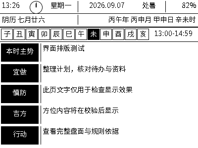
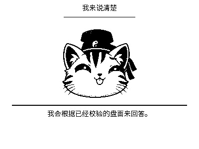
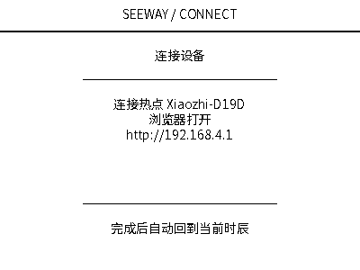

# 2026-09-07 插板前软件验收

## 本轮结论

本轮是界面、字库、配网状态和隐私静音的离线修复，不代表完整产品已可正式使用。
本阶段未枚举、打开、复位或烧录任何串口设备。

- 全量测试：56 个文件，512 项通过；TypeScript 类型检查通过。
- 同一套 SeeWay/LVGL 界面代码在电脑上原生渲染，14 个场景通过。
- 检查了字形覆盖、文字区域高度、非空像素、说话帧变化和长字幕滚动。
- ESP-IDF 6.0.2 的 4.2 寸专用固件编译通过。
- 应用 3,553,280 字节，小于 OTA 分区 4,128,768 字节。
- 构建编号 `build-20260907T100715Z`，未烧录；哈希见固件的 `build-evidence.json`。

## 修复内容

1. 总览、九宫格详情、小智和配网页面独立占用屏幕；只有总览保留日期栏。
2. 小智统一为 168 x 168 像素的素材与锚点，表情限制在脸部区域。
3. 加入离线中文字库，修复原基础字库缺字造成的残字、空白。
4. 十二时辰栏为当前时间范围预留足够宽度，避免时间段被截断。
5. 长字幕保留完整原文，在字幕区域内缓慢滚动；短字幕静止。
6. 后台时辰更新不再覆盖配网提示。
7. KEY 隐私静音增加音频采集锁，防止音频线程重新打开输入；解除后才允许采集。
8. 重复构建会更新旧准备目录的源码和编译注册，避免混入旧版构建配置。
9. 修复市场服务未导出导致的测试失败；市场规则仍明确保持未开放状态。

## 预览

这是实际界面代码的电脑渲染，不是真机照片。测试文字是明确标记的排版样例，
不是用户的推演结果，不能据此证明算法结论或实体屏刷新效果。







## 仍未完成

- 新小智固件尚未接入设备运行时同步服务。控制层可以计算和验证结果，MCP 工具
  也已注册，但没有运行时连接将新盘面推入设备并消费、完成待处理语音问题。
  不能宣称当前固件已经能实时读取奇门盘并回答。
- 普通聊天沿用上游语音链路，需要真机完成 Wi-Fi 配网、服务激活和录音播放验收。
- 真机待测：RLCD 显示、按键、麦克风、扬声器、回声消除、打断、断网恢复、
  电量估算和长时间运行。
- 市场奇门的独立规则审校及完整手机联动尚未完成，不可用时不借用个人盘结论。

下一阶段先接通并模拟验证“当前盘面同步 -> 设备上下文 -> 问题 -> 校验后回答”，
再通知用户插入 4.2 寸设备做明确范围的真机验收。

## 复现

```sh
npm test
npm run typecheck
bash firmware/xiaozhi-seeway/scripts/preview.sh
```

预览需要锁定上游源码、C++ 编译器和 CMake，可通过 `CMAKE` 指定可执行文件。
字库已随源码提供，普通构建不需要联网生成。重新生成时：

```sh
npm install --prefix firmware/xiaozhi-seeway/.tools --ignore-scripts --no-audit --no-fund lv_font_conv@1.5.3
node firmware/xiaozhi-seeway/scripts/prepare-font.mjs
```

字库来源、转换版本和哈希在 `assets/fonts/manifest.json`，OFL 许可证在
`assets/fonts/OFL.txt`。编译和预览脚本均不操作串口。

## 设备隔离

两块 `ESP32-S3-Touch-AMOLED-1.8` 属于其他项目，禁止打开串口、复位或烧录。
旧 4.2 寸板已退回；新板虽然同型号，必须独立核对身份和备份。
重新插板后不能凭芯片型号、端口顺序或历史 `usbmodem` 路径判断目标；
先核对系统 USB 序列号与私有设备记录，再对唯一匹配的 4.2 寸板操作。

测试通过只说明已覆盖场景的软件行为符合预期，不代表传统术数的现实预测能力得到验证。
